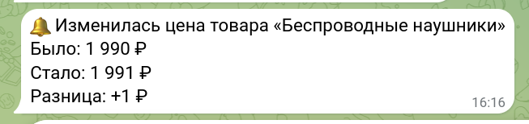
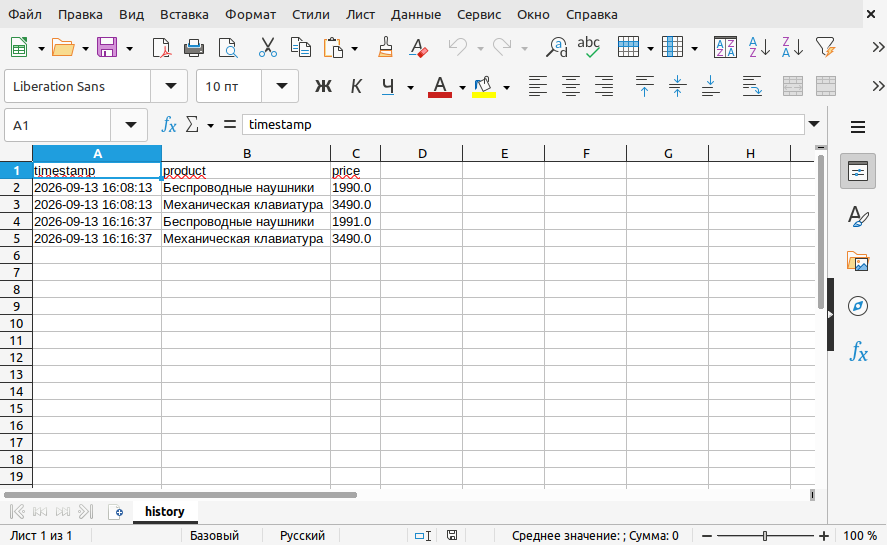

# Мониторинг цены на сайте с уведомлением в Telegram

Скрипт на Python, который проверяет цену товара на странице сайта, сравнивает
её с предыдущим значением и, если цена изменилась, присылает уведомление в
Telegram. Каждый запуск дописывает строку в CSV-историю — так со временем
накапливается лог изменений цены, по которому удобно строить график.

Типовой заказ на фрилансе: "хочу узнавать, когда конкурент/поставщик меняет
цену на сайте, без ручной проверки каждый день". Скрипт решает это без
собственного веб-интерфейса и базы данных — CSV-файл и Telegram-бот вполне
достаточны для одного-нескольких товаров.

## Быстрая проверка за 2 минуты (без Telegram)

Не нужен ни Telegram-бот, ни настройка GitHub Pages: по умолчанию `config.json`
указывает на локальную демо-страницу `testpage/index.html`, а флаг `--dry-run`
печатает уведомление в консоль вместо отправки в Telegram — токен и chat_id
для этого не требуются.

1. Установка (один раз):

   ```bash
   python3 -m venv .venv
   source .venv/bin/activate      # Windows: .venv\Scripts\activate
   pip install -r requirements.txt
   ```

2. Первый запуск — истории цен ещё нет, скрипт просто фиксирует текущую цену:

   ```bash
   python price_monitor.py --dry-run
   ```
   Вывод:
   ```
   Беспроводные наушники: первая проверка, цена зафиксирована — 1 990 ₽
   Механическая клавиатура: первая проверка, цена зафиксирована — 3 490 ₽
   ```

3. Откройте `testpage/index.html` в текстовом редакторе и поменяйте цену
   наушников:
   ```diff
   -    <div class="price">1 990 ₽</div>
   +    <div class="price">2 490 ₽</div>
   ```
   Сохраните файл.

4. Запустите ещё раз — цена отличается от записанной в истории, уведомление
   печатается в консоль (в обычном режиме то же самое ушло бы в Telegram):

   ```bash
   python price_monitor.py --dry-run
   ```
   Вывод:
   ```
   [DRY-RUN] Сообщение в Telegram:
   🔔 Изменилась цена товара «Беспроводные наушники»
   Было: 1 990 ₽
   Стало: 2 490 ₽
   Разница: +500 ₽
   Механическая клавиатура: цена не изменилась (3 490 ₽)
   ```

5. Проверка на ошибку: временно испортьте селектор в `config.json` —
   замените `"#product-1 .price"` на несуществующий `"#product-99 .price"` —
   и запустите снова:

   ```bash
   python price_monitor.py --dry-run
   ```
   Вывод — понятная ошибка вместо падения скрипта (то же самое пишется в
   `price_monitor.log`):
   ```
   [дата и время] Не удалось проверить цену «Беспроводные наушники»: элемент по селектору '#product-99 .price' не найден (возможно, изменилась структура сайта)
   [DRY-RUN] Сообщение в Telegram:
   ⚠️ Не удалось проверить цену «Беспроводные наушники»: элемент по селектору '#product-99 .price' не найден (возможно, изменилась структура сайта)
   Механическая клавиатура: цена не изменилась (3 490 ₽)
   ```
   Верните селектор и цену в исходное состояние, если хотите повторить проверку.

Полный режим с реальными уведомлениями в Telegram и запуском по расписанию —
в разделах ниже.

## Как это устроено

1. Скрипт запускается **один раз за вызов** — сам он ничего не ждёт и не
   зацикливается. Регулярность запуска (например, раз в час) настраивается
   снаружи: через `cron` на Linux/macOS или Планировщик заданий на Windows.
2. При запуске скрипт скачивает HTML страницы и находит цену по CSS-селектору
   (селектор задаётся в конфиге, не зашит в код).
3. Найденная цена сравнивается с последней записью в `history.csv` для этого
   товара.
4. Если цена изменилась — отправляется сообщение в Telegram: название товара,
   старая и новая цена, разница.
5. Если цена не изменилась — в историю всё равно добавляется строка (без
   уведомления), чтобы лог был непрерывным.
6. Если страница недоступна или структура сайта изменилась (селектор не
   находит цену) — скрипт не падает: пишет понятную ошибку в лог-файл и,
   по желанию, шлёт отдельное уведомление в Telegram "не удалось проверить
   цену".

## Структура проекта

```
price_monitor.py       — основной скрипт
config.json             — конфиг: URL, селекторы, chat_id (без токена)
requirements.txt
requirements-dev.txt    — зависимости для тестов (pytest)
tests/                  — тесты (pytest)
.env.example            — пример имени переменной окружения (скриптом не читается)
testpage/index.html     — тестовая страница-магазин для демонстрации
history.csv             — накопительная история цен (создаётся при первом запуске)
price_monitor.log       — лог ошибок (создаётся при первом запуске)
```

Код разложен на отдельные функции по шагам: скачивание страницы, извлечение
цены из HTML, разбор текста цены в число, чтение истории, поиск последней
цены, запись строки в историю, сборка текста уведомления, отправка в
Telegram, запись в лог. Каждый шаг — маленькая понятная функция, без классов.

## Установка

```bash
python3 -m venv .venv
source .venv/bin/activate      # Windows: .venv\Scripts\activate
pip install -r requirements.txt
```

## Настройка Telegram-бота

Нужны две вещи: **токен бота** и **chat_id** — идентификатор чата, куда бот
будет писать.

1. В Telegram найдите бота **@BotFather** и напишите ему `/newbot`.
2. Придумайте имя и username бота (username должен заканчиваться на `bot`,
   например `my_price_watch_bot`).
3. BotFather пришлёт **токен** вида `123456789:AAExampleTokenExampleToken`.
   Это и есть значение для `TELEGRAM_BOT_TOKEN` — храните его в секрете,
   в конфиг-файл он не попадает.
4. Напишите своему новому боту любое сообщение (например, "привет") — боты
   не могут писать первыми, это нужно, чтобы бот вас "увидел".
5. Узнайте свой `chat_id` одним из способов:
   - откройте в браузере
     `https://api.telegram.org/bot<ВАШ_ТОКЕН>/getUpdates`
     (подставив свой токен) и найдите в ответе `"chat":{"id": ...}` —
     это и есть chat_id;
   - либо напишите боту **@userinfobot** — он сразу пришлёт ваш `chat_id`.
6. Впишите `chat_id` в `config.json` (поле `telegram_chat_id`), а токен —
   в переменную окружения (см. ниже).

## Токен бота — только через переменную окружения

Токен даёт полный доступ к боту, поэтому он **не хранится в конфиг-файле** и
не должен попадать в git.

```bash
export TELEGRAM_BOT_TOKEN=123456789:AAExampleTokenExampleToken   # Linux/macOS
```

Windows (PowerShell):
```powershell
$env:TELEGRAM_BOT_TOKEN = "123456789:AAExampleTokenExampleToken"
```

Для регулярного запуска через cron/Планировщик токен нужно задавать там же,
где настроен вызов скрипта (см. раздел про автоматизацию ниже) — интерактивный
`export`/`$env:` действует только в текущей сессии терминала.

## Конфиг (`config.json`)

```json
{
  "url": "https://ваш-сайт.example/страница-товара",
  "products": [
    {
      "name": "Беспроводные наушники",
      "selector": "#product-1 .price"
    },
    {
      "name": "Механическая клавиатура",
      "selector": "#product-2 .price"
    }
  ],
  "telegram_chat_id": "123456789",
  "history_file": "history.csv",
  "log_file": "price_monitor.log",
  "notify_on_errors": true
}
```

- `url` — адрес страницы, которая проверяется. Поддерживается обычный
  http(s)-адрес, а также локальный файл — обычный путь (например,
  `testpage/index.html`) или `file://путь/к/файлу`; это удобно для проверки
  без интернета и без публикации страницы. Если товары на разных
  страницах — заводите под каждый отдельный конфиг и отдельный запуск.
- `products` — список товаров на этой странице. У каждого — `name` (как
  товар будет называться в истории и уведомлениях) и `selector` — CSS-селектор
  элемента с ценой (см. ниже, как его найти).
- `telegram_chat_id` — куда слать уведомления.
- `history_file` / `log_file` — пути к файлам истории и лога (необязательные,
  по умолчанию `history.csv` и `price_monitor.log` в текущей папке; запускайте
  скрипт из папки проекта).
- `notify_on_errors` — слать ли отдельное уведомление в Telegram при ошибке
  проверки (необязательное, по умолчанию `true`); лог пишется в любом случае.

## Как найти CSS-селектор цены

1. Откройте страницу товара в браузере, наведите на цену, нажмите правой
   кнопкой → «Просмотреть код» (Inspect).
2. В инструментах разработчика найдите тег с ценой, посмотрите его `class`
   или `id`, например `<div class="price">1 990 ₽</div>`.
3. Селектор для конфига — `.price` (по классу) или `#product-1 .price`,
   если на странице несколько товаров и нужно отличить их друг от друга по
   родительскому блоку.

Если позже верстка сайта поменяется и селектор перестанет находить цену,
скрипт не упадёт молча — это будет видно в логе и (если включено) в
Telegram-уведомлении об ошибке.

## Тестовая страница для демонстрации

В `testpage/index.html` — простая HTML-страница с двумя товарами
(`#product-1`, `#product-2`). Для быстрой проверки её не нужно никуда
публиковать — `config.json` по умолчанию указывает на неё локально (см.
раздел «Быстрая проверка» в начале README). Страницу также можно
опубликовать на GitHub Pages, если нужна демонстрация по прямой ссылке:

1. Создайте новый репозиторий на GitHub, положите в него `testpage/index.html`
   как `index.html` в корне.
2. В настройках репозитория включите GitHub Pages (Settings → Pages → Source:
   выбранная ветка, папка `/root`).
3. Через минуту-две страница будет доступна по адресу вида
   `https://ваш-юзернейм.github.io/название-репозитория/`.
4. Впишите этот адрес в `config.json` → `url`.
5. Чтобы продемонстрировать уведомление — откройте `index.html` в
   репозитории, вручную поменяйте цену в `<div class="price">...</div>`,
   закоммитьте и подождите обновления Pages, затем запустите скрипт ещё раз.

## Запуск

```bash
python price_monitor.py
python price_monitor.py --config config.json    # то же самое явно
python price_monitor.py --dry-run               # без Telegram: печатает уведомление в консоль
```

Флаг `--dry-run` не требует ни `TELEGRAM_BOT_TOKEN`, ни рабочего
`telegram_chat_id` — подходит для проверки логики скрипта без настройки бота
(см. «Быстрая проверка» в начале README).

При первом запуске для каждого товара в истории ещё нет записей — скрипт
просто фиксирует текущую цену без уведомления. Начиная со второго запуска
он сравнивает цену с предыдущей и уведомляет только при изменении.

## Пример вывода

Цена не менялась:
```
Беспроводные наушники: цена не изменилась (1 990 ₽)
```

Цена изменилась (то же уходит сообщением в Telegram):
```
🔔 Изменилась цена товара «Беспроводные наушники»
Было: 1 990 ₽
Стало: 1 991 ₽
Разница: +1 ₽
```

Реальное уведомление, полученное в Telegram при живом тесте на GitHub Pages:



Ошибка (страница недоступна или изменилась структура сайта) — пишется в
`price_monitor.log` и, если включено `notify_on_errors`, уходит в Telegram:
```
[2026-09-13 13:33:14] Не удалось проверить цену «Механическая клавиатура»: элемент по селектору '#product-99 .price' не найден (возможно, изменилась структура сайта)
```

## История цен (`history.csv`)

```csv
timestamp,product,price
2026-09-13 16:08:13,Беспроводные наушники,1990.0
2026-09-13 16:08:13,Механическая клавиатура,3490.0
2026-09-13 16:16:37,Беспроводные наушники,1991.0
2026-09-13 16:16:37,Механическая клавиатура,3490.0
```



Одна строка на каждый запуск для каждого товара — независимо от того, было
уведомление или нет. Это то, из чего строится график "история цены": просто
открыть CSV в Excel/Google Sheets и сделать линейную диаграмму по столбцам
`timestamp` и `price`.

## Автоматизация: как превратить разовый скрипт в регулярный мониторинг

Скрипт нарочно не содержит своего планировщика — расписание задаётся снаружи,
средствами операционной системы. Это то, что заказчик настраивает у себя,
чтобы мониторинг работал сам по себе, без ручного запуска.

**Linux/macOS — cron.** Проверка каждый час:

```
0 * * * * cd /путь/к/проекту && TELEGRAM_BOT_TOKEN=токен /путь/к/проекту/.venv/bin/python price_monitor.py >> cron.log 2>&1
```

Отредактировать расписание: `crontab -e`.

**Windows — Планировщик заданий (Task Scheduler).**

1. Открыть «Планировщик заданий» → «Создать задачу».
2. Триггер: например, «Ежедневно» с повтором задачи каждый час.
3. Действие: «Запуск программы» —
   программа: `C:\путь\к\проекту\.venv\Scripts\python.exe`,
   аргументы: `price_monitor.py`,
   рабочая папка: `C:\путь\к\проекту`.
4. Переменную `TELEGRAM_BOT_TOKEN` в этом случае проще задать один раз как
   переменную окружения пользователя (Панель управления → Система →
   Переменные среды), чтобы она была доступна при запуске по расписанию.

## Настройка под реальный сайт заказчика

Демо на GitHub Pages — только для показа механики. Чтобы применить скрипт
к настоящему сайту клиента, обычно достаточно поменять три вещи в
`config.json`, не трогая код:

1. **`url`** — адрес страницы товара на сайте заказчика.
2. **`selector`** для каждого товара — CSS-селектор блока с ценой на этой
   конкретной странице (см. раздел выше, как его найти через «Просмотреть
   код» в браузере). У каждого сайта своя вёрстка, поэтому селектор
   подбирается индивидуально под каждый заказ.
3. **`products`** — список того, что нужно отслеживать: можно указать один
   товар или несколько на одной странице.

Дальше — та же настройка `TELEGRAM_BOT_TOKEN` и постановка на cron/Планировщик,
описанные выше, только с адресом реального проекта заказчика вместо
демо-папки. С этого момента заказчик получает работающую автоматизацию:
скрипт сам проверяет цену по расписанию и сам присылает уведомление, когда
она меняется — без участия человека.

## Ограничения

- Работает только со статическим HTML: если цена подгружается через
  JavaScript уже в браузере (а не присутствует в исходном HTML страницы),
  `requests` её не увидит — потребуется headless-браузер (Selenium/Playwright),
  это отдельная, более тяжёлая доработка.
- Один конфиг — один URL. Товары на разных страницах отслеживаются отдельными
  конфигами и отдельными запусками (можно поставить несколько строк в cron).
- История и лог — простые файлы (CSV и текст), без базы данных: для
  демонстрационного проекта и небольшого числа товаров этого достаточно.
- Если в блоке с ценой оказывается несколько чисел (например, старая и новая
  цена рядом, как при зачёркнутой цене на распродаже), скрипт не гадает,
  какое из них верное — сообщает об ошибке, и нужен более точный CSS-селектор.
- Цена записывается в историю раньше, чем отправляется уведомление в Telegram.
  Поэтому при сбое отправки повторного уведомления об этом же изменении цены
  уже не будет (в истории оно уже зафиксировано) — но сообщение об ошибке
  отправки выводится в консоль (и, при регулярном запуске, попадёт в лог
  cron/Планировщика).

## Тесты

```bash
pip install -r requirements-dev.txt
pytest
```

## Стек

Python 3, requests, BeautifulSoup4, pandas, Telegram Bot API (через `requests`,
без дополнительных Telegram-библиотек — для отправки одного сообщения это
избыточно).
